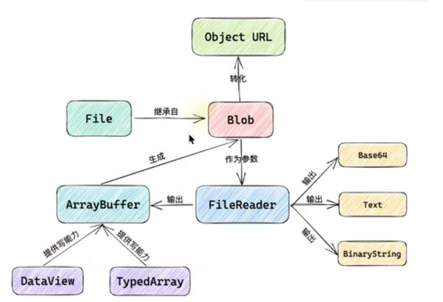

#### Blob

binary large object 二进制大对象, 可以存储大量二进制编码格式数据, 是不可修改.

读取 Blob 的唯一方式 FileReader

- 创建

```ts
new Blob(array, options)
其中两个参数:
array: 由 ArrayBuffer, ArrayBufferView, Blob, DOMString 等对象构成
options: 它可能会指定两个属性
        type: 默认 "", 表示将会被放入 Blob 中的数组内容的 MIME 类型
        endings: 默认值 "transparent", 用于指定包含结束符 \n 的字符串如何被写入, 不常用
MIME类型:
    text/plain  纯文本类型
    application/json ...

```

- 分片

```txt
Blob 底下内置 slice()
    start:
    end:
    contentType: 设置新的 MIME 类型, 如省略, 则默认为原始值

```

#### File

```txt
特殊的 Blob,与 Blob相比, 至少多有一个文件名,还有 日期戳等
File 的原型还是 Blob, 继承了 Blob

await blob.arrayBuffer()
await file.arrayBuffer()
两个是一样的, 数据层面基本相同

都可以通过 FileReader 读取
fr.readAsArrayBuffer(file)
fileReader 就可以读这个文件, 监听读取结束后, 有一个 fr.result
e.targget.result


在二进制层面进行修改, 就要用到 DataView
const dv = new DataView(await blob.arrayBuffer())
拿到二进制后.
console.log(dv.getUnit8(1)) // 取1个地址, 改成 65
dv.setUnit(1, 65)
```


URL

https://www.youtube.com/watch?v=cP5E0b21f_Y

```ts
// 当 fetch(url).then(res => res(blob)) 时
//               .then(blob => log(blob))
// 得到 Blob{size: 18134, type: 'image/jpeg'}

// new File([blob], '文件名', {type: blob.type})
// log(file)
// filereader readAsDataUrl() 读取的结果是一个二进制,  
```

