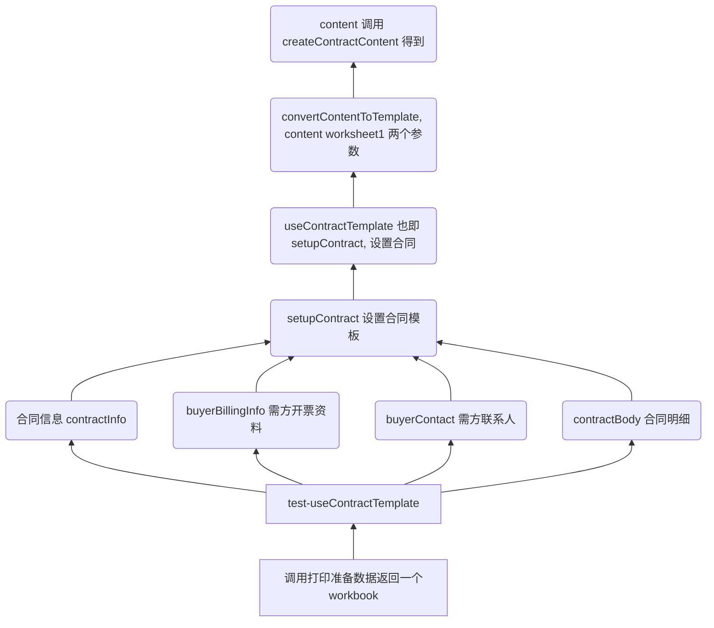

# 打印 excel 合同流程图

1. 准备好资料, 由 useContractTemplate  负责输出一个 workbook
2. useContractTemplate   调用 setupContract 设置一个模板
3. setupContract 调用 content 来设置模板的
4. content 是关键
5. content 里有固定数据和动态数据, 动态数据是 test-useContractTemplate  里传的

​        固定数据直接导入进来或者在 contractContent 里定义.

6. 样式文件也需要导入到 content

 

