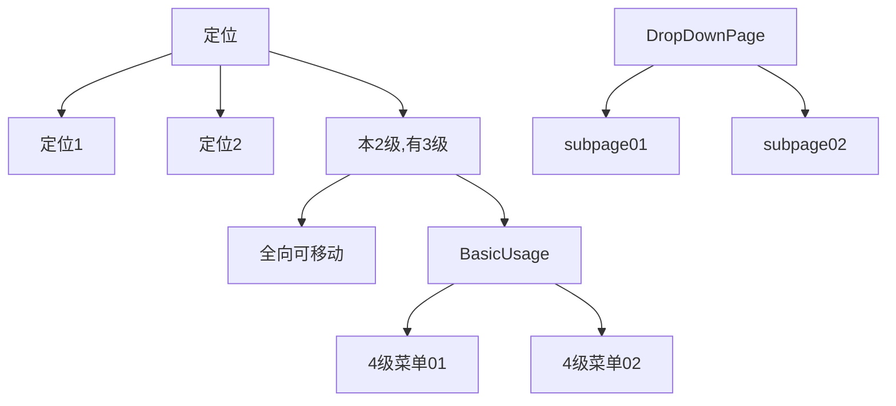

## <font color=red>侧边栏非递归实现总结</font>

1. 菜单的原始数据是多叉树的结构,例如, 像下面的结构



2. 通过 preOrder() 前序遍历使数组扁平化, 数组不在有树状结构, 但是层级关系的信息得到保存记录

​      通过逆向是可以回复树状结构的

3. 宽状态采用 默认的 static 定位, 窄状态 通过 tailwindcss 的 truncate 可以截断显示.

​      1级及以下菜单采用 绝对定位, 0级菜单采用默认的 static 定位

4. 宽状态时的显示, 只是在不同层级加了不同的缩进, 

```html
<li :style= ..."[ ...:{ paddingLeft: `${node.deep! * 0.75}rem`} ]"> 
    ...
</li>
```

5. 窄状态时, 0 级是默认的定位, 1 级是绝对定位, 所以, 显示也在 1 级及以下的这个出口 li 添加

```html
<li 
    :class="[ node.href ? 'cursor-pointer' : 'cursor-default', isNarrow ? 'absolute flex left-full px-4  bg-purple-900 ' : '', ]"
    // 这句的意思是: 1级菜单 向左偏移-100%, 1级菜单完全出现在 0 级菜单的右侧
    :style= "[isNarrow? {marginLeft: `${(node.deep!-1) * 12}rem`, marginTop: `${node.marginTop}rem` }: ... > 
    // 这句的意思是: 通过计算获取菜单的具体位置, 否则, 所有菜单会挤在一起.
    // 每一级菜单左边距 = `${(node.deep!-1) * 12}rem. 因为1级通过 left-full 右偏了.
    // 所以, node.deep -1, 不然, 1级菜单就会多出一个0级菜单宽度的间隙
    // |icon|  gap(有间隙) |定位1| 
    //                    |定位2| ...
    // |icon|      |    |
             
    // 而不是想要的这种效果
    // |icon|定位1     | 
    //      |定位2     | ...   
    // |icon|Sub Page1|
    ...
    // marginTop 的实现要复杂一些, 是通过点击切换当前节点是否展开折叠实时控制的
    // 原理是这样的:
    // 如果父节点有 marginTop 属性, 就为子节点设置 
    //     marginTop: node.marginTop + 2.5 + (i - 1) * 2.5 }         
    // 如果父节点没有, marginTop 就为子节点设置              
    //     marginTop: (i - 1) * 2.5 
    // i 是该层级的第几个节点 -1 是为了与父节点平齐. *2.5rem 是每行的高度
    // 0 级节点就没有 marginTop 属性, 因为这个属性是我加的.
    // 父节点有 marginTop, 子节点相对父节点定位, 所以要加上 node.marginTop,
    // 在 for 循环里加的, 实际作用在子组件.再加 2.5 的也是为了子级对齐
    // 上述公式可以简化成 :  node.marginTop +  i * 2.5 
    // 单位也是 rem
    // 上面的数字 12, 2.5 rem 可以用常量进行替换. 
    // const MARGIN_LEFT = 12 // 单位 rem
    // const ROW_HEIGHT = 2.5 // 单位 rem  calcMarginTop() 函数的 2.5         
</li>
   
```

具体的函数如下, 什么时候触发这个函数呢, 就是在窄状态时点击就触发, 没有设前置条件

```ts
// 点击时触发, 对树状数组进行更新操作
export const calcMarginTop = (node: IMenu) => {
  // 第1级的菜单不用处理, 由 css 接管
  // 当前根节点入栈
  const stack: IMenu[] = [node]
  while (stack.length > 0) {
    const currentNode = stack.pop()!
    // 检查当前点击的节点的孩子节点, 为所有孩子节点设置 marginTop
    if (currentNode.children) {
      const child = currentNode.children
      for (let i = child.length - 1; i >= 0; i--) {
        // 父节点的 marginTop
        if (node.marginTop) stack.push(reactive(Object.assign(child[i]!, { marginTop: node.marginTop + i * 2.5 })))
        else stack.push(reactive(Object.assign(child[i]!, { marginTop: (i - 1) * 2.5 })))
      }
    }
  }
}
```

6. 宽状态时的控制

```html
<li
  v-if=" ...: node.parentItem?.expanded && node.rootExpanded">
  // 子组件的显示与否有父组件控制  node.parentItem?.expanded 是起这个作用的
  // node.rootExpanded 是当前节点下的所有子节点, 包括孙节点..., 他们共同的根
  // 这2个变量似乎设置重复了, parentItem 也是所有节点共同的父节点, 由preorder()
  // 函数生成的, 
  // rootExpanded 由 updateTree()生成的, 就这一点可以再优化一下
  // TODO: 
</li>

```

7. 窄状态时的控制

​        窄状态控制的逻辑复杂, 下面试图理解下.

   ```ts
   // 1. 点击的是 0 级菜单
   // 2, 点击的是 1 级及以下层级菜单
   //   2.1. 点击没有孩子节点
   //   2.2. 点击带有孩子节点
   // 上面这个比较好判断
   // 下面针对不同的点击做下逻辑上的梳理.
   ```

​         0 级菜单点击时

```ts
1. 0级菜单点击的仅点击菜单显示 --- 需要 1 个变量控制
   0级菜单下所有菜单显示 --- 与上面的公用 1 个变量, currentId
        这里的1级菜单显示与否要看 0 级菜单, 所以 1 级菜单要保存 0 级菜单的信息.
        假如 0 级菜单的 节点id = '0000', 那么, 所有 1 级菜单都有 rootId 属性, 
        rootId = '0000', 点击 0 级后, currentId = '0000', 
        这样, 当设置 currentId === rootId 时, 就会显示 1级菜单
        这解决了显示问题. 
     当再次点击时, 却不会关闭, 所以需要有2个变量进行控制, 再增加一个变量, 这个变量作为
     1 级菜单的属性, rootExpanded, 当再次点击时, 节点的 expanded是切换的, rootExpanded 
     与 expanded 是联动的, 有 updateTree() 函数设置的, 这样能解决切换问题
     所以结果是这样的:  currentId === rootId  && node.rootExpanded

2. 现在分析一下1级及以下菜单点击 
  2.1  没有子节点(就是链接节点点击时), 这时, 只要设置 currentId = node.id, 相当于
       把当前节点值改变了 currentId !== rootId, 就会关闭菜单, 由于带有链接, 所以
       会导航到链接
  2.2  当点击有孩子节点时, 
       此时 还要 currentId === rootId && node.rootExpanded, 以维持显示
       currentId 维持的是当前点击, rootExpanded 是维持的是 点击根节点的切换
       
现在, 基本达到了预期的效果, 这是因为 rootExpanded 在 updateTee() 函数中维护的时候. 是从当前节点开始的, 可以进行切换
```

8. 问题处理. 

```html
1. 0 级一般需要点击2次才能切换, 
2. 有时菜单不在正确的位置对齐
3. 点击其他位置时关闭菜单
```

关于第2点, 可以在 preOrder() 函数中直接就预先设置好位置, 这是可以的, 因为宽状态没有用到这个 marginTop 参数, 这样窄状态时也不用更新 ucalcMarginTop(node) 了


