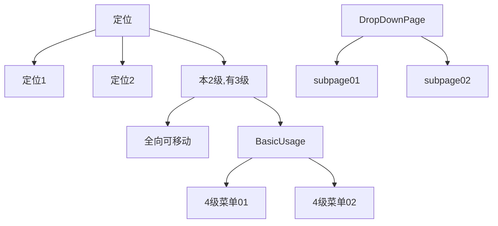

## <font color=red>侧边栏非递归实现总结</font>

1. 菜单的原始数据是多叉树的结构,例如, 像下面的结构



2. 状态分析

```tex
2-1: 宽状态:
   1,初始时: 
      1). 0级菜单(定位, DropDownPage这些)总是显示, 默认就是显示的.
      2). 1级菜单(定位1, 定位2, 本2级有3级, subpage01, subpage02), 
          2级菜单(全向可移动, BasicUsahe, 和2级下面的3级 4级菜单01, 4级菜单02).
          都不显示.
      3). 不显示的控制变量是 parentItem.expanded 和 rootExpanded
      4). 实现原理: 
          preOrder()函数进行前序遍历, 并分好层. 
          当拍平的数组进行循环时, 循环到哪一级, 就针对哪一级做判断.
          0级, 就是总是含有图标的那个, 不用做任何设置,循环到这一级总会显示.
               但是 0 级是父节点, 还担负着子级是否显示的任务, 所以, 在父节点
               上设置了 expanded 变量, 初始值为空, 意思是其下面的子菜单不显示.
          1级, 就是定位1, 定位2这些. 比如第1级, 其父节点0级,默认1级不显示, 在
               0 级上设置了 expanded=false, 获取这个值的办法是通过 
               node.parentItem.expanded 拿到父节点(0级)的这个显示与否的决
               定权, 子组件的显示与否决定权在父节点.
          2级, 既然1级都不显示,其以下所有级都不应当显示, 索性就在 preOrder() 
               迭代时都设置 expanded = false
          1级以下显示与否有2个变量, 父组件 node.parentItem.expanded 和 node.rootExpanded
          共同控制, 父组件的 expanded 和 本身的 rootExpanded, 二者都是 false. 初始
          时就不显示 1级和 1级以下, 0 级菜单上面说了, 总是显示的.
          
   2. 点击时: 触发 onToggleClick(node) 函数, 这个函数做的事情是
      node.expanded = !node.expanded
      node 是被点击的节点
      接下来调用 updateTree(node) 更新节点数据.
      如果点击的节点 expanded 由 false --> true, 这个节点下所有直接子节点的 
      rootExpanded 都和 被点击的 node.expanded 联动, 都置为 true, 而子节点
      本身的 expanded 并没有改变. 
      例如, 单位点击 0级菜单'定位'时, 下面的定位1, 2 这些子菜单的 rootExpanded 都变成了
      rootExpanded = true, 
      node.parentItem?.expanded  是当前点击节点后迭代的子节点的父节点, 代表当前节点的父节点
      rootExpanded 是子节点里保存的属于哪个父节点, 若同时为 true, 则显示, 若不同时为true, 
      就不显示.
```


  ```tex
  2-2: 窄状态. 窄状态比较复杂
  
  1. 需求分析:
     1). 一次点击只能显示一组, 另外的都要收起来
     2). 只有点击父级后才显示子级
     3). 元素的位置要正确, 子级顶部与父级平齐
     4). 点击链接时所有的菜单都收起来
     5). 点击0级菜单时, 切换显示
  2. 状态分析
     1). 初始时:
         初始时, 要只显示0级, 其他的都不显示, 这个默认的要求就可以达到.
     2). 点击时:
         点击显示时, 只显示直接子级, 再下面的孙级不显示, 其他的子级不显示, 其他兄弟节点不显示
                是当前节点的直接子级(排除孙节点, 其他兄弟节点)
                当前节点授权子级显示, 当前节点与其父节点联动
         再次隐藏时, 子级节点隐藏,  
     3). 鼠标进入时:
     4). 鼠标离开时:
  ```

在窄状态时, 当点击当前0级节点后, 该0 级节点的 expanded 切换, 

当点击同级节点时, 先前点击的节点并没有被切换成false, 还是 true, 当已经不是currentId了, 

所以出现2次点击现象

onMouseenter 不冒泡, 就用这个了

isActived 主管是否激活, 这是一个全局变量, 一次只能有1个菜单激活, 只有点击时才切换这个变量

​              currentId === node.parentId 只能对第0级点击有效, 


用 2 个变量控制, 一个变量控制是不是当前, 一个变量控制切换, 而且这个变量要加在父节点上, 要父节点控制子节点

没有子节点的只是显示, 只要一个变量就可以控制, 
